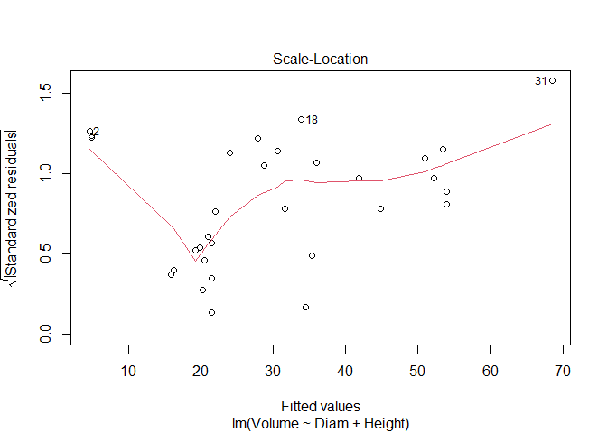
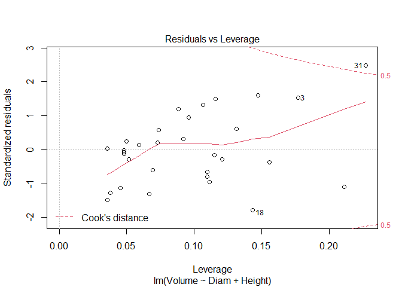
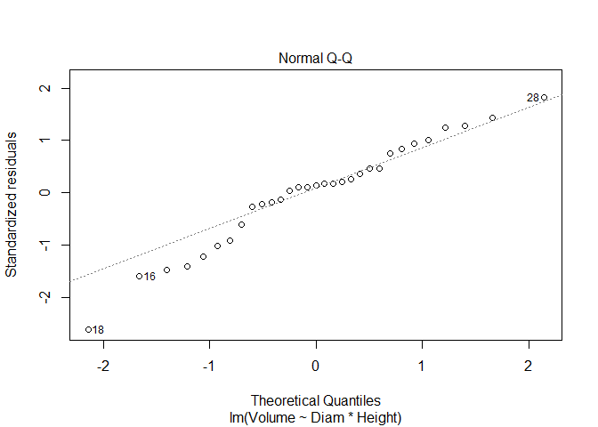
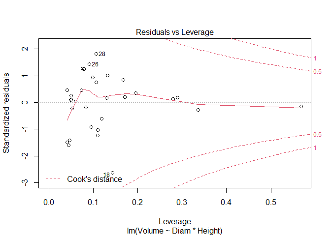
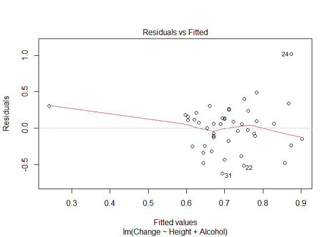
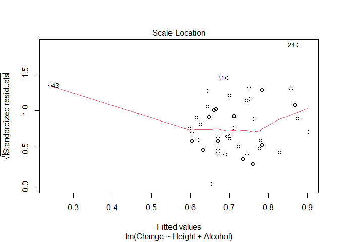
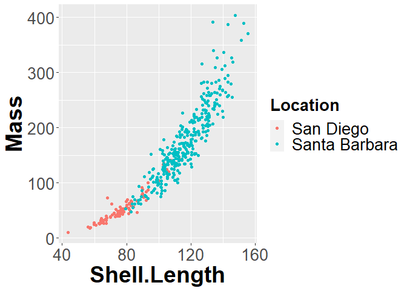
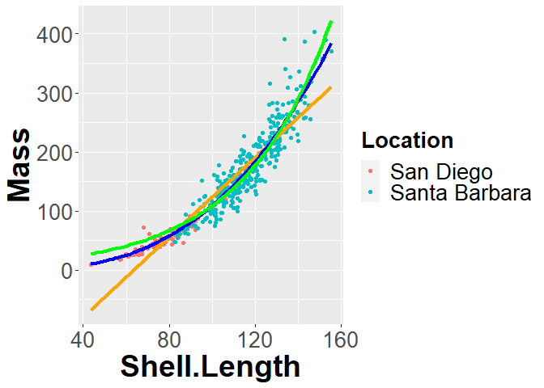
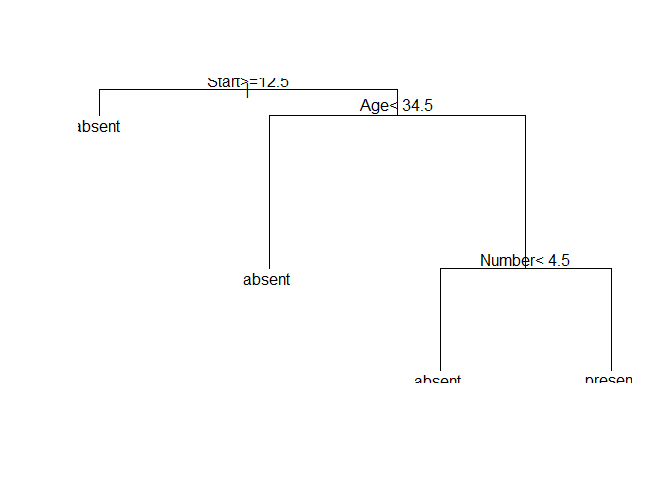
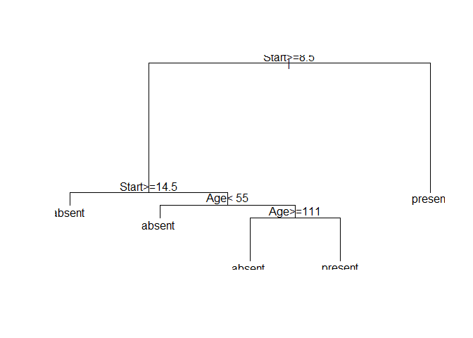

9\. Multiple regression and extensions
================
jsg
9/30/2020

Before doing this, review the **Week 6** lecture set slides from
<https://sites.google.com/view/biostats/bio-7800178002/week-9> and the
**10\_ANCOVA\_and\_Regression.R**(from line 248) and
\*11\_Mixed\_models\_and\_other\_extensions.R\*\* script in the lecture
files folder of the [CUNY-BioStats github
repository](https://github.com/jsgosnell/CUNY-BioStats). Make sure you
are comfortable with null and alternative hypotheses for all examples.

This assignment and the lecture it follows are meant as a starting point
for these models\! You could develop entire courses devoted to these
methods, so focus on their connections to linear models and when you
would use them.

Remember you should

  - add code chunks by clicking the *Insert Chunk* button on the toolbar
    or by pressing *Ctrl+Alt+I* to answer the questions\!
  - **knit** your file to produce a markdown version that you can see\!
  - save your work often
      - **commit** it via git\!
      - **push** updates to github

<!-- end list -->

1.  Data on the height, diameter, and volume of cherry trees was
    collected for use in developing an optimal model to predict timber
    volume. Data is available @

<http://www.statsci.org/data/general/cherry.txt>

Use the data to justify an optimal model.

``` r
cherry <- read.table("http://www.statsci.org/data/general/cherry.txt",
                     header = T)
head(cherry)
```

    ##   Diam Height Volume
    ## 1  8.3     70   10.3
    ## 2  8.6     65   10.3
    ## 3  8.8     63   10.2
    ## 4 10.5     72   16.4
    ## 5 10.7     81   18.8
    ## 6 10.8     83   19.7

``` r
#if only considering main effects (one option)
cherry_full <- lm(Volume ~ Diam + Height, cherry)
plot(cherry_full)
```

<!-- --><!-- --><!-- --><!-- -->

``` r
library(car)
```

    ## Loading required package: carData

``` r
Anova(cherry_full, type = "III")
```

    ## Anova Table (Type III tests)
    ## 
    ## Response: Volume
    ##             Sum Sq Df  F value    Pr(>F)    
    ## (Intercept)  679.0  1  45.0632  2.75e-07 ***
    ## Diam        4783.0  1 317.4129 < 2.2e-16 ***
    ## Height       102.4  1   6.7943   0.01449 *  
    ## Residuals    421.9 28                       
    ## ---
    ## Signif. codes:  0 '***' 0.001 '**' 0.01 '*' 0.05 '.' 0.1 ' ' 1

``` r
#both are significant, so finished

#could also consider interactions 
cherry_full <- lm(Volume ~ Diam * Height, cherry)
plot(cherry_full)
```

<!-- --><!-- --><!-- --><!-- -->

``` r
Anova(cherry_full, type = "III")
```

    ## Anova Table (Type III tests)
    ## 
    ## Response: Volume
    ##              Sum Sq Df F value    Pr(>F)    
    ## (Intercept)  62.185  1  8.4765 0.0071307 ** 
    ## Diam         68.147  1  9.2891 0.0051087 ** 
    ## Height      128.566  1 17.5248 0.0002699 ***
    ## Diam:Height 223.843  1 30.5119 7.484e-06 ***
    ## Residuals   198.079 27                      
    ## ---
    ## Signif. codes:  0 '***' 0.001 '**' 0.01 '*' 0.05 '.' 0.1 ' ' 1

``` r
#all significant, so finished
```

2.  Over the course of five years, a professor asked students in his
    stats class to carry out a simple experiment. Students were asked to
    measure their pulse rate, run for one minute, then measure their
    pulse rate again. The students also filled out a questionnaire. Data
    include:

| Variable | Description                                                              |
| -------- | ------------------------------------------------------------------------ |
| Height   | Height (cm)                                                              |
| Weight   | Weight (kg)                                                              |
| Age      | Age (years)                                                              |
| Gender   | Sex (1 = male, 2 = female)                                               |
| Smokes   | Regular smoker? (1 = yes, 2 = no)                                        |
| Alcohol  | Regular drinker? (1 = yes, 2 = no)                                       |
| Exercise | Frequency of exercise (1 = high, 2 = moderate, 3 = low)                  |
| Change   | Percent change in pulse (pulse after experiment/pulse before experiment) |
| Year     | Year of class (93 - 98)                                                  |

Using the available data (available at

<https://raw.githubusercontent.com/jsgosnell/CUNY-BioStats/master/datasets/pulse_class_copy.csv>
)

determine the optimal subset of explanatory variables that should be
used to predict change pulse rate (Change) (focusing on main effects
only, no interactions) and explain your choice of methods. Interpret
your results. Make sure you can explain any changes you needed to make
to the dataset or steps you used in your analysis.

``` r
pulse_class_copy <- read.csv("https://raw.githubusercontent.com/jsgosnell/CUNY-BioStats/master/datasets/pulse_class_copy.csv", stringsAsFactors = T)
pulse_class_copy$Gender <- as.factor(pulse_class_copy$Gender)
pulse_class_copy$Smokes <- as.factor (pulse_class_copy$Smokes)
pulse_class_copy$Alcohol <- as.factor(pulse_class_copy$Alcohol)

require(MuMIn)
```

    ## Loading required package: MuMIn

    ## Warning: package 'MuMIn' was built under R version 4.0.3

``` r
pulse_full <- lm(Change ~ ., pulse_class_copy )
pulse_final <- step(pulse_full)
```

    ## Start:  AIC=-94.24
    ## Change ~ Height + Weight + Age + Gender + Smokes + Alcohol + 
    ##     Exercise + Year
    ## 
    ##            Df Sum of Sq    RSS     AIC
    ## - Year      1  0.002178 4.0113 -96.218
    ## - Gender    1  0.002825 4.0119 -96.211
    ## - Smokes    1  0.006969 4.0161 -96.163
    ## - Age       1  0.007498 4.0166 -96.157
    ## - Weight    1  0.018975 4.0281 -96.026
    ## - Exercise  1  0.063201 4.0723 -95.524
    ## <none>                  4.0091 -94.243
    ## - Height    1  0.248912 4.2580 -93.473
    ## - Alcohol   1  0.275592 4.2847 -93.185
    ## 
    ## Step:  AIC=-96.22
    ## Change ~ Height + Weight + Age + Gender + Smokes + Alcohol + 
    ##     Exercise
    ## 
    ##            Df Sum of Sq    RSS     AIC
    ## - Gender    1  0.002745 4.0140 -98.187
    ## - Smokes    1  0.008748 4.0200 -98.118
    ## - Age       1  0.009061 4.0203 -98.115
    ## - Weight    1  0.020656 4.0319 -97.982
    ## - Exercise  1  0.061106 4.0724 -97.523
    ## <none>                  4.0113 -96.218
    ## - Height    1  0.247630 4.2589 -95.463
    ## - Alcohol   1  0.280615 4.2919 -95.108
    ## 
    ## Step:  AIC=-98.19
    ## Change ~ Height + Weight + Age + Smokes + Alcohol + Exercise
    ## 
    ##            Df Sum of Sq    RSS      AIC
    ## - Age       1  0.008872 4.0229 -100.085
    ## - Smokes    1  0.009773 4.0238 -100.075
    ## - Weight    1  0.019557 4.0336  -99.963
    ## - Exercise  1  0.058622 4.0726  -99.520
    ## <none>                  4.0140  -98.187
    ## - Height    1  0.258061 4.2721  -97.321
    ## - Alcohol   1  0.302450 4.3165  -96.845
    ## 
    ## Step:  AIC=-100.09
    ## Change ~ Height + Weight + Smokes + Alcohol + Exercise
    ## 
    ##            Df Sum of Sq    RSS      AIC
    ## - Smokes    1  0.009335 4.0322 -101.979
    ## - Weight    1  0.020707 4.0436 -101.849
    ## - Exercise  1  0.063527 4.0864 -101.365
    ## <none>                  4.0229 -100.085
    ## - Height    1  0.270131 4.2930  -99.096
    ## - Alcohol   1  0.293626 4.3165  -98.845
    ## 
    ## Step:  AIC=-101.98
    ## Change ~ Height + Weight + Alcohol + Exercise
    ## 
    ##            Df Sum of Sq    RSS     AIC
    ## - Weight    1  0.020452 4.0527 -103.75
    ## - Exercise  1  0.055663 4.0879 -103.35
    ## <none>                  4.0322 -101.98
    ## - Height    1  0.263914 4.2961 -101.06
    ## - Alcohol   1  0.285822 4.3181 -100.83
    ## 
    ## Step:  AIC=-103.75
    ## Change ~ Height + Alcohol + Exercise
    ## 
    ##            Df Sum of Sq    RSS     AIC
    ## - Exercise  1   0.07307 4.1258 -104.92
    ## <none>                  4.0527 -103.75
    ## - Alcohol   1   0.28662 4.3393 -102.60
    ## - Height    1   0.39237 4.4451 -101.50
    ## 
    ## Step:  AIC=-104.92
    ## Change ~ Height + Alcohol
    ## 
    ##           Df Sum of Sq    RSS     AIC
    ## <none>                 4.1258 -104.92
    ## - Alcohol  1   0.25346 4.3792 -104.18
    ## - Height   1   0.43164 4.5574 -102.35

``` r
#consider assumptions
plot(pulse_final)
```

<!-- --><!-- --><!-- --><!-- -->

``` r
Anova(pulse_final, type = "III")
```

    ## Anova Table (Type III tests)
    ## 
    ## Response: Change
    ##             Sum Sq Df F value  Pr(>F)  
    ## (Intercept) 0.0434  1  0.4520 0.50500  
    ## Height      0.4316  1  4.4987 0.03973 *
    ## Alcohol     0.2535  1  2.6416 0.11141  
    ## Residuals   4.1258 43                  
    ## ---
    ## Signif. codes:  0 '***' 0.001 '**' 0.01 '*' 0.05 '.' 0.1 ' ' 1

``` r
#or
library(MuMIn)
options(na.action = "na.fail")
auto <- dredge(pulse_full)
```

    ## Fixed term is "(Intercept)"

``` r
write.csv(auto, "dredge_output.csv", row.names = F)
options(na.action = "na.omit")
```

3.  In a study considering how the presence of sea stars changed snail
    growth patterns, \~25 snails were grown in containers containing
    0,1, or 2 seastars.  
    Since non-consumptive effects are often threshold based, these
    treatments levels should be considered as groups (not as a
    continuous variable\!). The data is available at

<https://raw.githubusercontent.com/jsgosnell/CUNY-BioStats/master/datasets/snail_modified_for_class.csv>

FL is the final length of measured snails, and the treatment (coded 1-3)
correspond to \[1=Control (no predators). 2=1 predator treatment,3=2
predator treatment).

What method would you use to analyze this data and why? Carry out your
test, stating your null hypothesis, test assumptions, p-value, and
interpretation.  
Describe any necessary steps and provide graphics and values as needed.
If needed, can you determine which treatments differ from each other?

``` r
snail <- read.csv("https://raw.githubusercontent.com/jsgosnell/CUNY-BioStats/master/datasets/snail_modified_for_class.csv")
head(snail)
```

    ##   Container Treatment    FL
    ## 1         1         3 22.50
    ## 2         1         3 20.61
    ## 3         1         3 23.13
    ## 4         1         3 23.71
    ## 5         1         3 24.40
    ## 6         1         3 23.62

``` r
snail$Treatment <- as.factor(snail$Treatment)
require(plyr)
```

    ## Loading required package: plyr

``` r
snail$Treatment_new <- revalue(snail$Treatment, c("1" = "Control", "2" = "Single predator",
                                                  "3" = "Two predators"))

require(lme4)
```

    ## Loading required package: lme4

    ## Loading required package: Matrix

    ## Registered S3 methods overwritten by 'lme4':
    ##   method                          from
    ##   cooks.distance.influence.merMod car 
    ##   influence.merMod                car 
    ##   dfbeta.influence.merMod         car 
    ##   dfbetas.influence.merMod        car

``` r
snail_mm <- lmer(FL ~ Treatment_new + (1|Container), snail)
summary(snail_mm)
```

    ## Linear mixed model fit by REML ['lmerMod']
    ## Formula: FL ~ Treatment_new + (1 | Container)
    ##    Data: snail
    ## 
    ## REML criterion at convergence: 1163.4
    ## 
    ## Scaled residuals: 
    ##      Min       1Q   Median       3Q      Max 
    ## -2.62147 -0.68438  0.04799  0.62360  2.93899 
    ## 
    ## Random effects:
    ##  Groups    Name        Variance Std.Dev.
    ##  Container (Intercept) 0.6509   0.8068  
    ##  Residual              8.2124   2.8657  
    ## Number of obs: 234, groups:  Container, 12
    ## 
    ## Fixed effects:
    ##                              Estimate Std. Error t value
    ## (Intercept)                   23.7426     0.5178  45.857
    ## Treatment_newSingle predator  -2.2159     0.7295  -3.037
    ## Treatment_newTwo predators    -1.8844     0.7353  -2.563
    ## 
    ## Correlation of Fixed Effects:
    ##             (Intr) Trt_Sp
    ## Trtmnt_nwSp -0.710       
    ## Trtmnt_nwTp -0.704  0.500

``` r
plot(snail_mm)
```

<!-- -->

``` r
check_mixed_model <- function (model, model_name = NULL) {
  #collection of things you might check for mixed model
  par(mfrow = c(2,3))
  #not sure what this does with mutliple random effects, so stop with 1 for now
  if(length(names(ranef(model))<2)){
    qqnorm(ranef(model, drop = T)[[1]], pch = 19, las = 1, cex = 1.4, main= paste(model_name, 
                                                                                  "\n Random effects Q-Q plot"))
  }
  plot(fitted(model),residuals(model), main = paste(model_name, 
                                                    "\n residuals vs fitted"))
  qqnorm(residuals(model), main =paste(model_name, 
                                       "\nresiduals q-q plot"))
  qqline(residuals(model))
  hist(residuals(model), main = paste(model_name, 
                                      "\nresidual histogram"))
}

check_mixed_model(snail_mm)


require(car)
Anova(snail_mm, type = "III")
```

    ## Analysis of Deviance Table (Type III Wald chisquare tests)
    ## 
    ## Response: FL
    ##                  Chisq Df Pr(>Chisq)    
    ## (Intercept)   2102.876  1  < 2.2e-16 ***
    ## Treatment_new   10.681  2   0.004792 ** 
    ## ---
    ## Signif. codes:  0 '***' 0.001 '**' 0.01 '*' 0.05 '.' 0.1 ' ' 1

``` r
require(multcomp)
```

    ## Loading required package: multcomp

    ## Loading required package: mvtnorm

    ## Loading required package: survival

    ## Loading required package: TH.data

    ## Loading required package: MASS

    ## 
    ## Attaching package: 'TH.data'

    ## The following object is masked from 'package:MASS':
    ## 
    ##     geyser

``` r
snail_comparison <- glht(snail_mm, linfct = mcp(Treatment_new = "Tukey"))
summary(snail_comparison)
```

    ## 
    ##   Simultaneous Tests for General Linear Hypotheses
    ## 
    ## Multiple Comparisons of Means: Tukey Contrasts
    ## 
    ## 
    ## Fit: lmer(formula = FL ~ Treatment_new + (1 | Container), data = snail)
    ## 
    ## Linear Hypotheses:
    ##                                      Estimate Std. Error z value Pr(>|z|)   
    ## Single predator - Control == 0        -2.2159     0.7295  -3.037  0.00663 **
    ## Two predators - Control == 0          -1.8844     0.7353  -2.563  0.02811 * 
    ## Two predators - Single predator == 0   0.3315     0.7326   0.453  0.89328   
    ## ---
    ## Signif. codes:  0 '***' 0.001 '**' 0.01 '*' 0.05 '.' 0.1 ' ' 1
    ## (Adjusted p values reported -- single-step method)

``` r
#graph using Rmisc
library(Rmisc)
```

    ## Loading required package: lattice

``` r
library(ggplot2)
graph_output <- summarySE(snail, measurevar = "FL", groupvars = "Treatment_new")
bar_graph_with_error_bars <- ggplot(graph_output, 
                                     aes_string(x="Treatment_new", 
                                                y = "FL")) +
  geom_col() + 
  geom_errorbar(aes(ymin = FL - ci, 
                    ymax = FL + ci))+
  xlab("Treatment")+
  theme(axis.title.x = element_text(face="bold", size=28), 
        axis.title.y = element_text(face="bold", size=28), 
        axis.text.y  = element_text(size=20),
        axis.text.x  = element_text(size=20), 
        legend.text =element_text(size=20),
        legend.title = element_text(size=20, face="bold"),
        plot.title = element_text(hjust = 0.5, face="bold", size=32))+
ylim(c(0, 30))

bar_graph_with_error_bars
```

<!-- -->

4.  (From OZDasl) The data give the ambient temperature and the number
    of primary O-rings damaged for 23 of the 24 space shuttle launches
    before the launch of the space shuttle Challenger on January 20,
    1986. (Challenger was the 25th shuttle. One engine was lost at sea
    and could not be examined.) Each space shuttle contains 6 primary
    O-rings.

Note these are counts. We can analyze this data using a Poisson
distribution or binomial. Make sure you understand why each one is
possible, which one is better, and carry out the analysis. Data is
available @

<http://www.statsci.org/data/general/challenger.txt>

``` r
rings <- read.table("http://www.statsci.org/data/general/challenger.txt", 
                    header = T)
#can do as poisson
rings_poisson <- glm(Damaged ~ Temp, rings, family = "poisson")
summary(rings_poisson)
```

    ## 
    ## Call:
    ## glm(formula = Damaged ~ Temp, family = "poisson", data = rings)
    ## 
    ## Deviance Residuals: 
    ##      Min        1Q    Median        3Q       Max  
    ## -0.92135  -0.76907  -0.54934  -0.02268   2.50169  
    ## 
    ## Coefficients:
    ##             Estimate Std. Error z value Pr(>|z|)  
    ## (Intercept)   5.9691     2.7628   2.161   0.0307 *
    ## Temp         -0.1034     0.0430  -2.405   0.0162 *
    ## ---
    ## Signif. codes:  0 '***' 0.001 '**' 0.01 '*' 0.05 '.' 0.1 ' ' 1
    ## 
    ## (Dispersion parameter for poisson family taken to be 1)
    ## 
    ##     Null deviance: 22.434  on 22  degrees of freedom
    ## Residual deviance: 16.834  on 21  degrees of freedom
    ## AIC: 36.061
    ## 
    ## Number of Fisher Scoring iterations: 6

``` r
#note dispersion is ok
require(car)
Anova(rings_poisson, type = "III")
```

    ## Analysis of Deviance Table (Type III tests)
    ## 
    ## Response: Damaged
    ##      LR Chisq Df Pr(>Chisq)  
    ## Temp   5.6004  1    0.01796 *
    ## ---
    ## Signif. codes:  0 '***' 0.001 '**' 0.01 '*' 0.05 '.' 0.1 ' ' 1

``` r
#or binomial (preffered as we can add info (number damaged and not!))
rings_binomial <- glm(cbind(Damaged, 6 - Damaged) ~ Temp, rings, family = "binomial")
summary(rings_binomial)
```

    ## 
    ## Call:
    ## glm(formula = cbind(Damaged, 6 - Damaged) ~ Temp, family = "binomial", 
    ##     data = rings)
    ## 
    ## Deviance Residuals: 
    ##      Min        1Q    Median        3Q       Max  
    ## -0.95227  -0.78299  -0.54117  -0.04379   2.65152  
    ## 
    ## Coefficients:
    ##             Estimate Std. Error z value Pr(>|z|)  
    ## (Intercept)  5.08498    3.05247   1.666   0.0957 .
    ## Temp        -0.11560    0.04702  -2.458   0.0140 *
    ## ---
    ## Signif. codes:  0 '***' 0.001 '**' 0.01 '*' 0.05 '.' 0.1 ' ' 1
    ## 
    ## (Dispersion parameter for binomial family taken to be 1)
    ## 
    ##     Null deviance: 24.230  on 22  degrees of freedom
    ## Residual deviance: 18.086  on 21  degrees of freedom
    ## AIC: 35.647
    ## 
    ## Number of Fisher Scoring iterations: 5

``` r
#note dispersion is ok
Anova(rings_binomial, type = "III")
```

    ## Analysis of Deviance Table (Type III tests)
    ## 
    ## Response: cbind(Damaged, 6 - Damaged)
    ##      LR Chisq Df Pr(>Chisq)  
    ## Temp    6.144  1    0.01319 *
    ## ---
    ## Signif. codes:  0 '***' 0.001 '**' 0.01 '*' 0.05 '.' 0.1 ' ' 1

``` r
#compare to lm
rings_lm <- lm(Damaged ~ Temp, rings)
summary(rings_lm)
```

    ## 
    ## Call:
    ## lm(formula = Damaged ~ Temp, data = rings)
    ## 
    ## Residuals:
    ##     Min      1Q  Median      3Q     Max 
    ## -0.5608 -0.3944 -0.0854  0.1056  1.8671 
    ## 
    ## Coefficients:
    ##             Estimate Std. Error t value Pr(>|t|)   
    ## (Intercept)  3.69841    1.21951   3.033  0.00633 **
    ## Temp        -0.04754    0.01744  -2.725  0.01268 * 
    ## ---
    ## Signif. codes:  0 '***' 0.001 '**' 0.01 '*' 0.05 '.' 0.1 ' ' 1
    ## 
    ## Residual standard error: 0.5774 on 21 degrees of freedom
    ## Multiple R-squared:  0.2613, Adjusted R-squared:  0.2261 
    ## F-statistic: 7.426 on 1 and 21 DF,  p-value: 0.01268

``` r
#note dispersion is ok
Anova(rings_lm, type = "III")
```

    ## Anova Table (Type III tests)
    ## 
    ## Response: Damaged
    ##             Sum Sq Df F value  Pr(>F)   
    ## (Intercept) 3.0667  1  9.1973 0.00633 **
    ## Temp        2.4762  1  7.4264 0.01268 * 
    ## Residuals   7.0021 21                   
    ## ---
    ## Signif. codes:  0 '***' 0.001 '**' 0.01 '*' 0.05 '.' 0.1 ' ' 1

5.  Returning to the whelk length-mass relationship from class, try
    fitting an exponential curve to the data. As a hint, try

<!-- end list -->

``` r
nls(Mass ~ exp(b0 + b1 * Shell.Length), whelk, 
                   start = list(b0 =1, b1=0), na.action = na.omit)
```

Compare this model to those that assume a linear and power relationship.
Data is available @

<https://raw.githubusercontent.com/jsgosnell/CUNY-BioStats/master/datasets/whelk.csv>

``` r
whelk <- read.csv("https://raw.githubusercontent.com/jsgosnell/CUNY-BioStats/master/datasets/whelk.csv")
head(whelk)
```

    ##    Location   Mass Sex Shell.Length
    ## 1 San Diego 126.10   F           NA
    ## 2 San Diego 119.92   M       106.21
    ## 3 San Diego  40.07   M        75.58
    ## 4 San Diego 140.82   F       107.59
    ## 5 San Diego  49.70   M        76.23
    ## 6 San Diego     NA   M        70.10

``` r
summary(whelk)
```

    ##    Location              Mass             Sex             Shell.Length   
    ##  Length:473         Min.   :  9.906   Length:473         Min.   : 43.58  
    ##  Class :character   1st Qu.: 87.352   Class :character   1st Qu.: 90.50  
    ##  Mode  :character   Median :150.325   Mode  :character   Median :109.89  
    ##                     Mean   :152.590                      Mean   :106.56  
    ##                     3rd Qu.:209.476                      3rd Qu.:122.30  
    ##                     Max.   :403.892                      Max.   :155.28  
    ##                     NA's   :28                           NA's   :33

``` r
require(ggplot2)
whelk_plot <- ggplot(whelk, aes_string(x="Shell.Length", y = "Mass")) +
  geom_point(aes_string(colour = "Location")) + 
  theme(axis.title.x = element_text(face="bold", size=28), 
        axis.title.y = element_text(face="bold", size=28), 
        axis.text.y  = element_text(size=20),
        axis.text.x  = element_text(size=20), 
        legend.text =element_text(size=20),
        legend.title = element_text(size=20, face="bold"),
        plot.title = element_text(hjust = 0.5, face="bold", size=32))
whelk_plot
```

    ## Warning: Removed 61 rows containing missing values (geom_point).

<!-- -->

``` r
#power fit
whelk_lm <- lm(Mass ~ Shell.Length, whelk, na.action = na.omit)

whelk_power <- nls(Mass ~ b0 * Shell.Length^b1, whelk, 
                   start = list(b0 = 1, b1=3), na.action = na.omit)
whelk_exponential <- nls(Mass ~ exp(b0 + b1 * Shell.Length), whelk, 
                         start = list(b0 =1, b1=0), na.action = na.omit)
AICc(whelk_lm, whelk_power, whelk_exponential)
```

    ##                   df     AICc
    ## whelk_lm           3 3947.579
    ## whelk_power        3 3800.106
    ## whelk_exponential  3 3841.422

``` r
#plot
whelk_plot + geom_smooth(method = "lm", se = FALSE, size = 1.5, color = "orange")+ 
  geom_smooth(method="nls", 
              # look at whelk_power$call
              formula = y ~ b0 * x^b1, 
              method.args = list(start = list(b0 = 1, 
                                              b1 = 3)), 
              se=FALSE, size = 1.5, color = "blue") +
  geom_smooth(method="nls", 
              # look at whelk_exponential$call
              formula = y ~ exp(b0 + b1 * x), 
              method.args = list(start = list(b0 = 1, 
                                              b1 = 0)), 
              se=FALSE, size = 1.5, color = "green")
```

    ## `geom_smooth()` using formula 'y ~ x'

    ## Warning: Removed 61 rows containing non-finite values (stat_smooth).

    ## Warning: Removed 61 rows containing non-finite values (stat_smooth).
    
    ## Warning: Removed 61 rows containing non-finite values (stat_smooth).

    ## Warning: Removed 61 rows containing missing values (geom_point).

<!-- -->

6.  Going back to the TEAM dataset, remember we found that elevation had
    no impact on carbon storage. But that was a linear fit. Use a gam
    (generalized additive model) to see if elevation can be related to
    carbon storage in an additive model. Note we can use the gamm
    (generalized additive mixed model) function in the mgcv package to
    denote mixed effects. For example (from help file)

<!-- end list -->

``` r
b2 <- gamm(y~s(x0)+s(x1)+s(x2),family=poisson,
           data=dat,random=list(fac=~1))
```

Team data is available @

<https://github.com/jsgosnell/CUNY-BioStats/blob/master/datasets/team_data_no_spaces.csv>

``` r
require(mgcv)
```

    ## Loading required package: mgcv

    ## Loading required package: nlme

    ## 
    ## Attaching package: 'nlme'

    ## The following object is masked from 'package:lme4':
    ## 
    ##     lmList

    ## This is mgcv 1.8-31. For overview type 'help("mgcv-package")'.

``` r
require(MuMIn) #for AICc
team <- read.csv("https://raw.githubusercontent.com/jsgosnell/CUNY-BioStats/master/datasets/team_data_no_spaces.csv", stringsAsFactors = T)
elevation_linear <- gam(PlotCarbon.tonnes ~ Elevation, data = team)
elevation_gam <- gam(PlotCarbon.tonnes ~ s(Elevation), data = team)
elevation_gamm <- gamm(PlotCarbon.tonnes ~s(Elevation), random = list(Site.Name = ~ 1), data = team)
AICc(elevation_gam, elevation_gamm, elevation_linear)
```

    ##                  df     AICc
    ## elevation_gam     3 648.2139
    ## elevation_gamm    5 634.4652
    ## elevation_linear  3 648.2139

## Tree graph review

7.  Kyphosis refers an issue with spinal curvature. Use the kyphosis
    dataset built into rpart to build and compare classification trees
    that minimize mis-labeling (default, Gini’s index) and that maximize
    information gain (add parms = list(split = ‘information’) to your
    rpart call).

<!-- end list -->

``` r
require(rpart)
```

    ## Loading required package: rpart

``` r
head(kyphosis)
```

    ##   Kyphosis Age Number Start
    ## 1   absent  71      3     5
    ## 2   absent 158      3    14
    ## 3  present 128      4     5
    ## 4   absent   2      5     1
    ## 5   absent   1      4    15
    ## 6   absent   1      2    16

``` r
kyphosis_tree_information <- rpart(Kyphosis ~ ., data = kyphosis, 
                                   parms = list(split = 'information'))
plot(kyphosis_tree_information)
text(kyphosis_tree_information)
```

<!-- -->

``` r
kyphosis_tree_gini <- rpart(Kyphosis ~ ., data = kyphosis)
plot(kyphosis_tree_gini)
text(kyphosis_tree_gini)
```

<!-- -->
