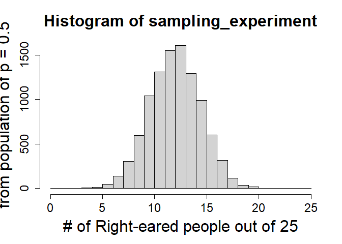
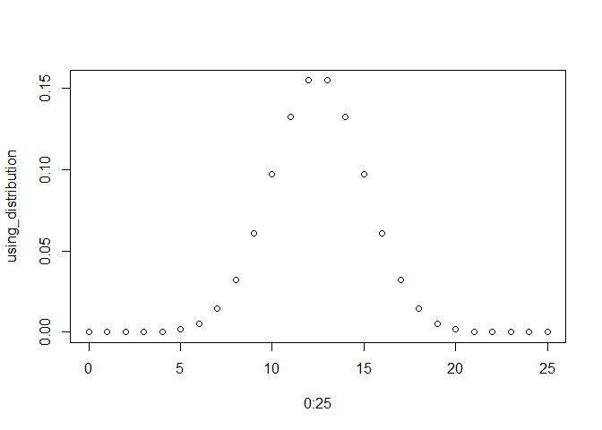
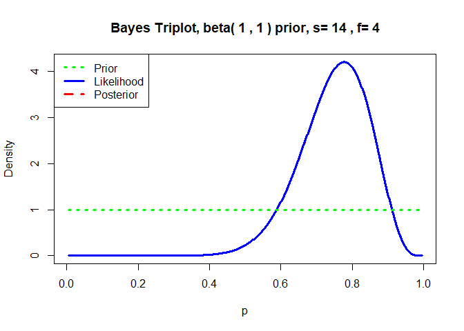
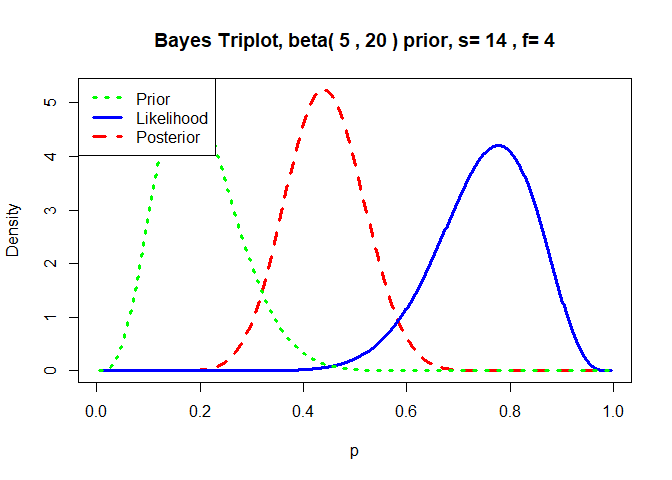
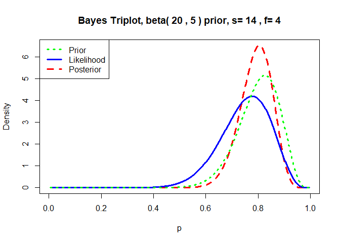

3\. Introduction to hypothesis testing via binomial tests
================
jsg
9/23/2020

Before doing this, review the **Introduction To Hypothesis Testing Via
Binomial Tests** lecture set slides from
<https://sites.google.com/view/biostats/bioenv-2100/hypothesis-testing-with-the-binomial-distribution>
and the **3\_hypothesis\_testing\_and\_binomial.R** script in the
lecture\_files folder of the [CUNY-BioStats github
repository](https://github.com/jsgosnell/CUNY-BioStats).

Remember you should

  - add code chunks by clicking the *Insert Chunk* button on the toolbar
    or by pressing *Ctrl+Alt+I* to answer the questions\!
  - **knit** your file to produce a markdown version that you can see\!
  - save your work often
      - **commit** it via git\!
      - **push** updates to github

## Hypothesis Testing and the Binomial Distribution

1.  Are people eared (do they prefer one ear or another)? Of 25 people
    observed while in conversation in a nightclub, 19 turned their right
    ear to the speaker and 6 turn their left ear to the speaker. How
    strong is the evidence for eared-ness given this data (adapted from
    Analysis of Biological Data)?

<!-- end list -->

  - state a null and alternative hypothesis H<sub>o</sub>: proportion of
    right-eared people is equal to .5 H<sub>a</sub>: proportion of
    right-eared people is note equal to .5
  - calculate a test statistic (signal) for this data

<!-- end list -->

``` r
19/25 #sample proportion
```

    ## [1] 0.76

  - Make you understand how to construct a null distribution
      - using sampling/simulation (code or written explanation)

<!-- end list -->

``` r
sampling_experiment = rbinom(10000, 25, .5)
hist(sampling_experiment, breaks = 0:25, xlab = "# of Right-eared people out of 25", ylab = "Probability of being drawn \n from population of p = 0.5", cex.main = 2, cex.axis = 1.5, cex.lab = 2)
```

<!-- -->

  - by using an appropriate distribution (code or written explanation)

<!-- end list -->

``` r
using_distribution = dbinom(0:25,25,.5)
using_distribution
```

    ##  [1] 2.980232e-08 7.450581e-07 8.940697e-06 6.854534e-05 3.769994e-04
    ##  [6] 1.583397e-03 5.277991e-03 1.432598e-02 3.223345e-02 6.088540e-02
    ## [11] 9.741664e-02 1.328409e-01 1.549810e-01 1.549810e-01 1.328409e-01
    ## [16] 9.741664e-02 6.088540e-02 3.223345e-02 1.432598e-02 5.277991e-03
    ## [21] 1.583397e-03 3.769994e-04 6.854534e-05 8.940697e-06 7.450581e-07
    ## [26] 2.980232e-08

``` r
sum(using_distribution)
```

    ## [1] 1

``` r
Number_righteared = c(0:25)
pdf = data.frame(Number_righteared, using_distribution)
plot(0:25, using_distribution)
```

<!-- -->

\*Calculate and compare p-values obtained using + simulation
(calculation won’t be required on test, but make sure you understand\!)
(code or written explanation)

``` r
length(sampling_experiment[sampling_experiment >= 19 | sampling_experiment <= 6])/length(sampling_experiment)
```

    ## [1] 0.0134

  - equations for binomial distribution (code or written explanation)

<!-- end list -->

``` r
(1-pbinom(18,25,.5)) * 2
```

    ## [1] 0.0146333

  - R functions (required)(code)

<!-- end list -->

``` r
binom.test(19,25, p=.5)
```

    ## 
    ##  Exact binomial test
    ## 
    ## data:  19 and 25
    ## number of successes = 19, number of trials = 25, p-value = 0.01463
    ## alternative hypothesis: true probability of success is not equal to 0.5
    ## 95 percent confidence interval:
    ##  0.5487120 0.9064356
    ## sample estimates:
    ## probability of success 
    ##                   0.76

  - Calculate a 95% confidence interval for the proportion of people who
    are right-eared

<!-- end list -->

``` r
library(binom)
binom.confint(x=19, n=25, alpha=.05, method="all") #use Agresti-coull 
```

    ##           method  x  n mean     lower     upper
    ## 1  agresti-coull 19 25 0.76 0.5624805 0.8882596
    ## 2     asymptotic 19 25 0.76 0.5925865 0.9274135
    ## 3          bayes 19 25 0.75 0.5854415 0.9037771
    ## 4        cloglog 19 25 0.76 0.5420481 0.8842776
    ## 5          exact 19 25 0.76 0.5487120 0.9064356
    ## 6          logit 19 25 0.76 0.5584422 0.8880044
    ## 7         probit 19 25 0.76 0.5666202 0.8934027
    ## 8        profile 19 25 0.76 0.5724026 0.8967715
    ## 9            lrt 19 25 0.76 0.5724301 0.8968455
    ## 10     prop.test 19 25 0.76 0.5447916 0.8984194
    ## 11        wilson 19 25 0.76 0.5657032 0.8850369

``` r
#or
binom.confint(x=19, n=25, alpha=.05, method="agresti-coull")
```

    ##          method  x  n mean     lower     upper
    ## 1 agresti-coull 19 25 0.76 0.5624805 0.8882596

*Our 95% CI is .562 - .888. Note it does not include .5\!* \* How do
your 95% confidence interval and hypothesis test compare? *The p-value
from all methods are \<.05, so I reject the null hypothesis that the
proportion of right-eared people is equal to .5. The 95% 5% CI is .562 -
.888. Note it does not include .5\!*

2.  A professor lets his dog take every multiple-choice test to see how
    it compares to his students (I know someone who did this).
    Unfortunately, the professor believes undergraduates in the class
    tricked him by helping the dog do better on a test. It’s a 100
    question test, and every questions has 4 answer choices. For the
    last test, the dog picked 33 questions correctly. How likely is this
    to happen, and is there evidence the students helped the dog?

MAKE SURE TO THINK ABOUT YOUR TEST OPTIONS

``` r
#use sided test as you only care if students helped the dog
binom.test(33,100, alternative="greater", p=.25)
```

    ## 
    ##  Exact binomial test
    ## 
    ## data:  33 and 100
    ## number of successes = 33, number of trials = 100, p-value = 0.0446
    ## alternative hypothesis: true probability of success is greater than 0.25
    ## 95 percent confidence interval:
    ##  0.2523035 1.0000000
    ## sample estimates:
    ## probability of success 
    ##                   0.33

*I chose to use a sided test since the professor wants to know if the
students helped the dog.  
I found a p-value of .04, so I reject the null hypothesis that the
proportion of correct answers is .25 (what I would expect by chance).*

## Distribution and Bayes

3.  Review the videos we watched in class

<!-- end list -->

  - <https://www.youtube.com/watch?v=mhlc7peGlGg>
  - <https://www.youtube.com/watch?v=o_djTy3G0pg>

<!-- end list -->

4.  I’ve shared a script in R that lets you test the Monty Hall idea
    (like in the video\!). It’s the chivers\_monty\_hall\_script from
    the [code\_examples
    folder](https://github.com/jsgosnell/CUNY-BioStats/tree/master/code_examples)code\_examples  
    on github. For this question, its easiest to just source the main
    file and see what happens. When you source a script, it is run in R
    without showing any console output (but graphs and objects are still
    produced\!). Try
    *source(“<https://raw.githubusercontent.com/jsgosnell/CUNY-BioStats/master/code_examples/chivers_monty_hall_script.R>”)*
    , then test out the idea here using the following functions which
    calculate outcomes under each strategy.

<!-- end list -->

  - monty(strat=“stay”, print\_games=F)
  - monty(strat=“switch”, print\_games=F)
  - monty(strat=“random”, print\_games=F)

<!-- end list -->

``` r
source("https://raw.githubusercontent.com/jsgosnell/CUNY-BioStats/master/code_examples/chivers_monty_hall_script.R")
monty(strat="stay", print_games=F)
```

    ## Using the stay strategy, your win percentage was 31.5%

``` r
monty(strat="switch", print_games=F)
```

    ## Using the switch strategy, your win percentage was 68%

``` r
monty(strat="random", print_games=F)
```

    ## Using the random strategy, your win percentage was 51.3%

5.  Setup the Monty Hall problem as probabilities and convince yourself
    how it works. You may want to remember to think about prior and new
    information (likelihoods).

6.  Run the frog analysis (14/18 frogs are right-pawed) assuming an
    “uninformed” prior (is this really possible?) and priors that
    predict frogs are likely to be left- or right-handed (look under
    Bayesian analysis in script for functions such as triplot and
    qbeta). Vary both the relationship among the shape variables and the
    magnitude (weighting) to understand how the prior impacts your
    posterior.

<!-- end list -->

``` r
library(LearnBayes)
#even, uniform (uninformed) prior
triplot(prior = c(1,1), data = c(14,4), where = "topleft")
```

<!-- -->

``` r
#prior assumes left handed
triplot(prior = c(5,20), data = c(14,4), where = "topleft")
```

<!-- -->

``` r
#prior assumes right handed 
triplot(prior = c(20,5), data = c(14,4), where = "topleft")
```

<!-- -->

``` r
#less sure right handed
triplot(prior = c(4,2), data = c(14,4), where = "topleft")
```

<!-- -->
