4\. Continuous tests for 1 population
================
jsg
9/8/2020

Before doing this, review the **Introduction to normality and one-sample
tests for continous data** lecture set slides from
<https://sites.google.com/view/biostats/bioenv-2100/introduction-to-normality-and-one-sample-tests>
and the **4\_normality.R** script in the lecture\_files folder of the
[CUNY-BioStats github
repository](https://github.com/jsgosnell/CUNY-BioStats).

You’ll also use the qqplot\_example.R and central\_limit\_theorem.R
script from the [code\_examples
folder](https://github.com/jsgosnell/CUNY-BioStats/tree/master/code_examples).

Remember you should

  - add code chunks by clicking the *Insert Chunk* button on the toolbar
    or by pressing *Ctrl+Alt+I* to answer the questions\!
  - **knit** your file to produce a markdown version that you can see\!
  - save your work often
      - **commit** it via git\!
      - **push** updates to github

## Recognizing and assessing normality

1.  Using the qqplot\_example.R code, examine the following
    distributions and, for the continuous distributions (marked with a
    “\*”), observe how a normal probability plot (qqplot) can be used
    to visually test for approximate normality.

<!-- end list -->

  - \*Normal (u= 0; σ<sup>2</sup>= 1, 10, 100)
  - \*Student’s t (df = 1, 10, 30, & 100)
  - \*Chi-square (df= 1, 2, 5, 30, 50)
  - Bernoulli (P=0.1, 0.5, & 0.9)
  - Binomial (P=0.05; N= 2, 5, 25, & 50); (P=0.25; N= 2, 5, 25, & 50);
    (P=0.50; N= 2, 5, 25, & 50); (P=0.75; N= 2, 5, 25, & 50); (P=0.95;
    N= 2, 5, 25, & 50)
  - Poisson ( u= 2, 5, 10, 30, & 50)

For this question, its easiest to just source the main file and see what
happens. When you source a script, it is run in R without showing any
console output (but graphs and objects are still produced\!). Try
*source("<https://raw.githubusercontent.com/jsgosnell/CUNY-BioStats/master/code_examples/qqplot_example.R>)*

``` r
source("https://raw.githubusercontent.com/jsgosnell/CUNY-BioStats/master/code_examples/qqplot_example.R")
```

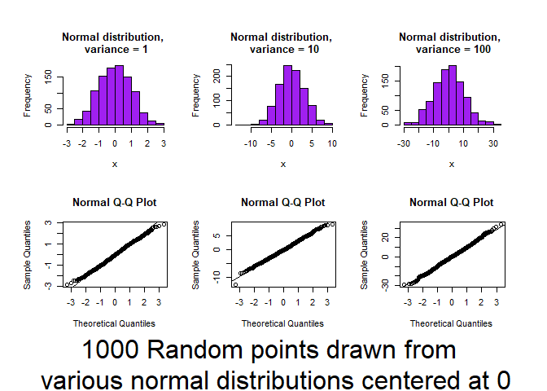<!-- -->

    ## Press [enter] to continue

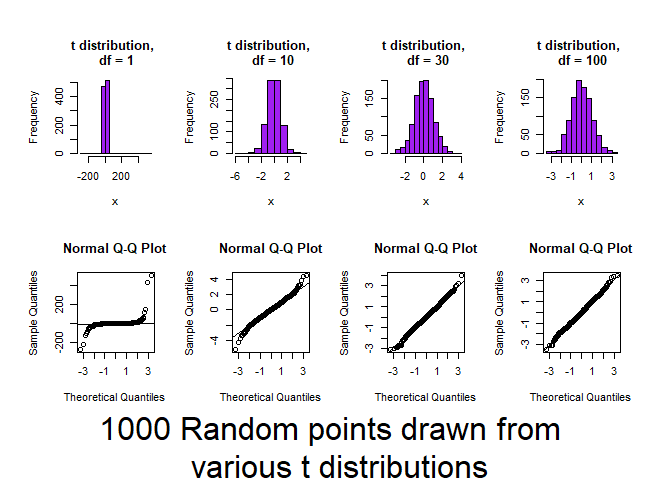<!-- -->

    ## Press [enter] to continue

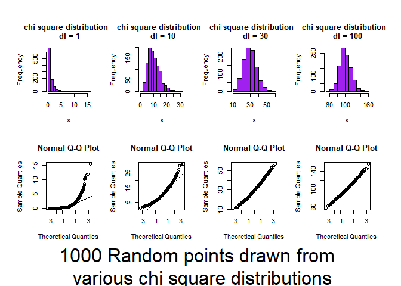<!-- -->

    ## Press [enter] to continue

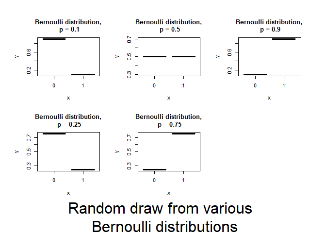<!-- -->

    ## Press [enter] to continue

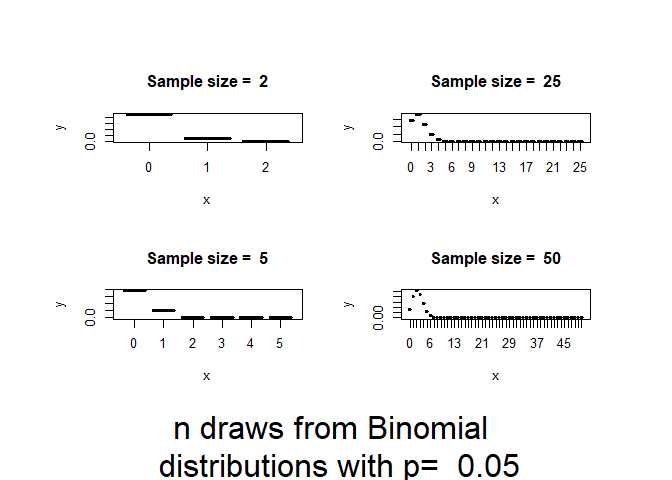<!-- -->

    ## Press [enter] to continue

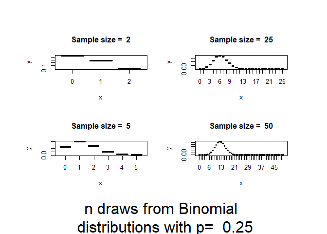<!-- -->

    ## Press [enter] to continue

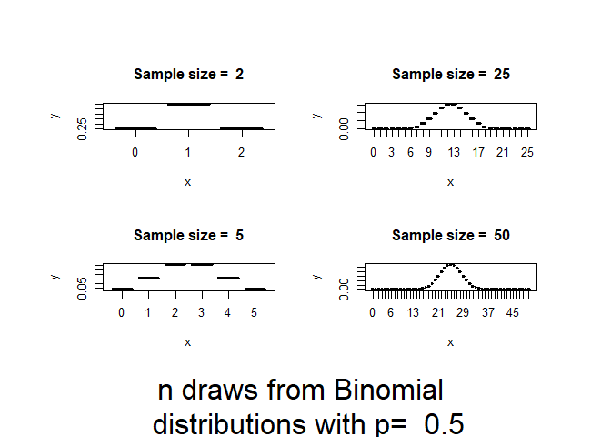<!-- -->

    ## Press [enter] to continue

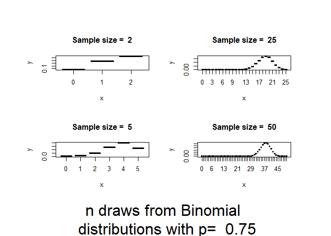<!-- -->

    ## Press [enter] to continue

<!-- -->

    ## Press [enter] to continue

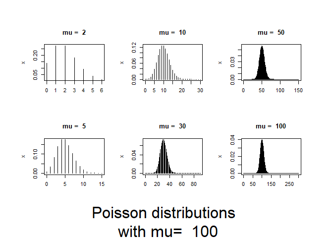<!-- -->

*Notice the spread of DATA of every distribution tend towards normality
as sample size increases*

2.  Review the central\_limit\_theorem.R code if you need to
    convince/remind yourself how common normality of means is for even
    non-normal data. You can source the code using the same approach
    noted in Question 1.

*Here we are focused on how the means look as sample size increases*

``` r
#make sure you have VGAM library installed
source("https://raw.githubusercontent.com/jsgosnell/CUNY-BioStats/master/code_examples/central_limit_theorem.R")
```

    ## Press [enter] to continue

    ## Loading required package: VGAM

    ## Loading required package: stats4

    ## Loading required package: splines

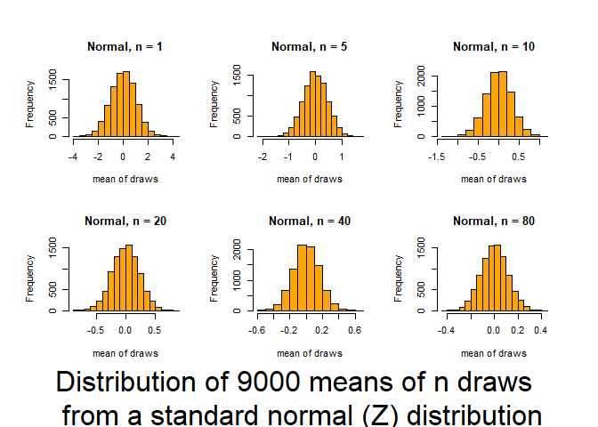<!-- -->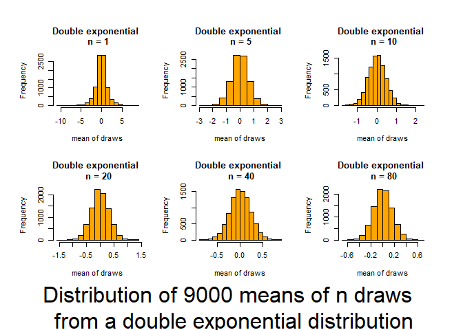<!-- -->

    ## Press [enter] to continue

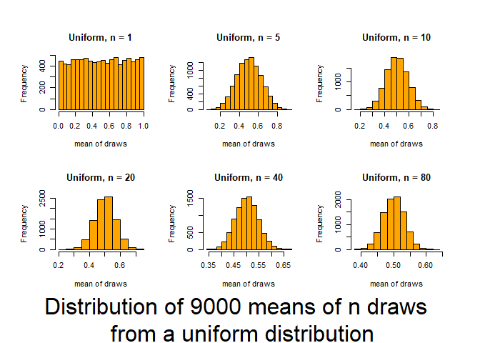<!-- -->

    ## Press [enter] to continue

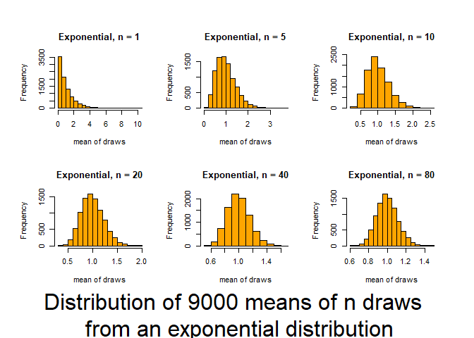<!-- -->

    ## Press [enter] to continue

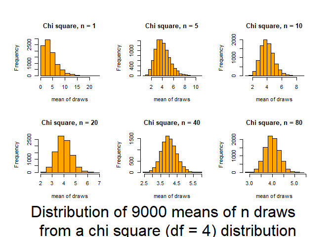<!-- -->

    ## Press [enter] to continue

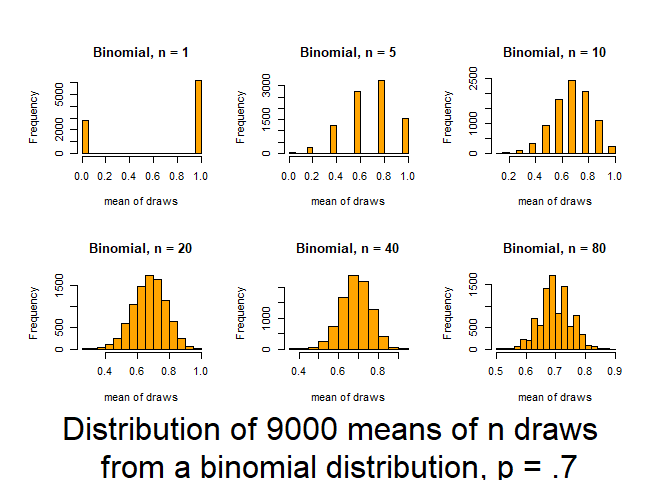<!-- -->

## Just for practice (note some sample sizes may be too small for these to all be good ideas\!)

Make sure you are comfortable with null and alternative hypotheses for
all examples. You should also feel comfortable graphing the data.

3.  Seven observers were shown, for a brief period, a grill with 161
    flies impaled and were asked to estimate the number. The results are
    given by Cochran (1954). Based on five estimates, they were 183.2,
    149.0, 154.0, 167.2, 187.2, 158.0, and 143.0. Test the null
    hypothesis that the mean of the estimates is 161 flies.

<!-- end list -->

  - Assuming variance = 275

<!-- end list -->

``` r
flies <- c(183.2, 149.0, 154.0, 167.2, 187.2, 158.0, 143.0)
library(BSDA)
```

    ## Loading required package: lattice

    ## 
    ## Attaching package: 'BSDA'

    ## The following object is masked from 'package:datasets':
    ## 
    ##     Orange

``` r
z.test(x=flies, mu = 161, sigma.x=sqrt(275))
```

    ## 
    ##  One-sample z-Test
    ## 
    ## data:  flies
    ## z = 0.33276, p-value = 0.7393
    ## alternative hypothesis: true mean is not equal to 161
    ## 95 percent confidence interval:
    ##  150.8010 175.3704
    ## sample estimates:
    ## mean of x 
    ##  163.0857

*Using a z-test, I found a test statistics of z\~=0.33 .This corresponds
to a p-value of 0.73. This p value is \>.05, so I fail to reject the
null hypothesis that the mean of the estimates is 161 flies.*

  - Estimating the variance from the data

<!-- end list -->

``` r
t.test(x=flies,mu = 161)
```

    ## 
    ##  One Sample t-test
    ## 
    ## data:  flies
    ## t = 0.32656, df = 6, p-value = 0.7551
    ## alternative hypothesis: true mean is not equal to 161
    ## 95 percent confidence interval:
    ##  147.4576 178.7138
    ## sample estimates:
    ## mean of x 
    ##  163.0857

*Using a t-test, which is appropriate when the variance must be
estimated from the sample and the means of the data may be assumed to
follow a normal distribution, I found a test statistics of
t<sub>6</sub>=0.32. This corresponds to a p-value of 0.76. This p-value
is \>.05, so I fail to reject the null hypothesis that the mean of the
estimates is 161 flies.*

  - Using rank transform analysis

<!-- end list -->

``` r
wilcox.test(flies, mu=161)
```

    ## 
    ##  Wilcoxon signed rank exact test
    ## 
    ## data:  flies
    ## V = 15, p-value = 0.9375
    ## alternative hypothesis: true location is not equal to 161

*Using a Wilcoxon signed rank test, which is appropriate when normality
assumptions can’t be met and the distribution of the data appears to be
symmetric, I found a test statistics of V = 15 .This corresponds to a
p-value of 0.94. This p-value is \>.05, so I fail to reject the null
hypothesis that the mean of the estimates is 161 flies.*

  - Using binary transform analysis

<!-- end list -->

``` r
SIGN.test(flies, md=161)
```

    ## 
    ##  One-sample Sign-Test
    ## 
    ## data:  flies
    ## s = 3, p-value = 1
    ## alternative hypothesis: true median is not equal to 161
    ## 95 percent confidence interval:
    ##  144.8857 185.9429
    ## sample estimates:
    ## median of x 
    ##         158 
    ## 
    ## Achieved and Interpolated Confidence Intervals: 
    ## 
    ##                   Conf.Level   L.E.pt   U.E.pt
    ## Lower Achieved CI     0.8750 149.0000 183.2000
    ## Interpolated CI       0.9500 144.8857 185.9429
    ## Upper Achieved CI     0.9844 143.0000 187.2000

*Using a sign test, which is appropriate when the data is continuous and
other assumptions can’t be met, I found a test statistics of s = 3 .This
corresponds to a p-value of 1. This p-value is \>.05, so I fail to
reject the null hypothesis that the median (**Note change here**) of the
estimates is 161 flies.*

4.  Yields of 10 strawberry plants in a uniformity trial are given by
    Baker and Baker (1953) as 239, 176, 235, 217, 234, 216, 318, 190,
    181, and 225 g. Test the hypothesis that µ = 205

<!-- end list -->

  - Assuming variance = 1500

<!-- end list -->

``` r
strawberries <- c(239, 176, 235, 217, 234, 216, 318, 190, 181, 225)
z.test(x=strawberries,mu = 205, sigma.x=sqrt(1500))
```

    ## 
    ##  One-sample z-Test
    ## 
    ## data:  strawberries
    ## z = 1.4779, p-value = 0.1394
    ## alternative hypothesis: true mean is not equal to 205
    ## 95 percent confidence interval:
    ##  199.0954 247.1046
    ## sample estimates:
    ## mean of x 
    ##     223.1

*Using a z-test, I found a test statistics of z=1.48. This corresponds
to a p-value of 0.14. This p-value is \>.05, so I fail to reject the
null hypothesis that the population mean is equal to 205.*

  - Estimating the variance from the data

<!-- end list -->

``` r
t.test(x=strawberries,mu = 205)
```

    ## 
    ##  One Sample t-test
    ## 
    ## data:  strawberries
    ## t = 1.4164, df = 9, p-value = 0.1903
    ## alternative hypothesis: true mean is not equal to 205
    ## 95 percent confidence interval:
    ##  194.1922 252.0078
    ## sample estimates:
    ## mean of x 
    ##     223.1

*Using a t-test, which is appropriate when the variance must be
estimated from the sample and the means of the data may be assumed to
follow a normal distribution, I found a test statistics of
t<sub>9</sub>=1.42. This corresponds to a p-value of 0.19. This p-value
is \>.05, so I fail to reject the null hypothesis that the population
mean is equal to 205.*

  - Using rank transform analysis

<!-- end list -->

``` r
wilcox.test(strawberries, mu=205)
```

    ## Warning in wilcox.test.default(strawberries, mu = 205): cannot compute exact p-
    ## value with ties

    ## 
    ##  Wilcoxon signed rank test with continuity correction
    ## 
    ## data:  strawberries
    ## V = 40.5, p-value = 0.2023
    ## alternative hypothesis: true location is not equal to 205

*Using a Wilcoxon signed rank test, which is appropriate when normality
assumptions can’t be met and the distribution of the data appears to be
symmetric, I found a test statistics of V=40.5. This corresponds to a
p-value of 0.20. This p-value is \>.05, so I fail to reject the null
hypothesis that the population mean is equal to 205.*

  - Using binary transform analysis

<!-- end list -->

``` r
SIGN.test(strawberries, md=205)
```

    ## 
    ##  One-sample Sign-Test
    ## 
    ## data:  strawberries
    ## s = 7, p-value = 0.3437
    ## alternative hypothesis: true median is not equal to 205
    ## 95 percent confidence interval:
    ##  183.9200 237.7022
    ## sample estimates:
    ## median of x 
    ##         221 
    ## 
    ## Achieved and Interpolated Confidence Intervals: 
    ## 
    ##                   Conf.Level L.E.pt   U.E.pt
    ## Lower Achieved CI     0.8906 190.00 235.0000
    ## Interpolated CI       0.9500 183.92 237.7022
    ## Upper Achieved CI     0.9785 181.00 239.0000

*Using a sign test, which is appropriate when the data is continuous and
other assumptions can’t be met, I found a test statistics of s= 7. This
corresponds to a p-value of 0.34. This p-value is \>.05,so I fail to
reject the null hypothesis that the population median (**Note change
here**) is equal to 205.*

4.  Evolutionary geneticists predicts the family sex ratio will be 80%
    female in broods of eagles that successfully fledge \>3 young. Nests
    that fledge 3 or more chicks are very rare but a sample of 30 chicks
    are obtained from such nests and they yield 25 females and 5 males.
    Test the hypotheses that that:

<!-- end list -->

  - 1)  the sex ratio is 50% females

<!-- end list -->

``` r
#a
binom.test(25,30, p=.5)
```

    ## 
    ##  Exact binomial test
    ## 
    ## data:  25 and 30
    ## number of successes = 25, number of trials = 30, p-value = 0.0003249
    ## alternative hypothesis: true probability of success is not equal to 0.5
    ## 95 percent confidence interval:
    ##  0.6527883 0.9435783
    ## sample estimates:
    ## probability of success 
    ##              0.8333333

*A binomial test was used as we are comparing an observed proportion
against a set value. Given a p-value of \<.001, I reject the null
hypothesis that the proportion of sons is equal to .5.*

  - 2)  the sex ratio is 80% females.

<!-- end list -->

``` r
binom.test(25,30, .8)
```

    ## 
    ##  Exact binomial test
    ## 
    ## data:  25 and 30
    ## number of successes = 25, number of trials = 30, p-value = 0.8205
    ## alternative hypothesis: true probability of success is not equal to 0.8
    ## 95 percent confidence interval:
    ##  0.6527883 0.9435783
    ## sample estimates:
    ## probability of success 
    ##              0.8333333

*A binomial test was used as we are comparing an observed proportion
against a set value. Given a p-value of \<.001, I fail to reject the
null hypothesis that the proportion of sons is equal to .8.*

5.  Studies of flying snakes have led researchers to posit the mean
    undulation rate is 1.4 Hz. You wish to test this hypothesis using
    the small sample of undulation rates shown below. Create a small
    dataset of the paradise tree snake undulation rates and choose and
    justify a test you can use to assess the data.

Undulation rates (in Hz): 0.9, 1.4, 1.2, 1.2, 1.3, 2.0, 1.4, 1.6

``` r
snakes <- c(0.9, 1.4, 1.2, 1.2, 1.3, 2.0, 1.4, 1.6)
t.test(snakes, mu=1.4)
```

    ## 
    ##  One Sample t-test
    ## 
    ## data:  snakes
    ## t = -0.21822, df = 7, p-value = 0.8335
    ## alternative hypothesis: true mean is not equal to 1.4
    ## 95 percent confidence interval:
    ##  1.104098 1.645902
    ## sample estimates:
    ## mean of x 
    ##     1.375

*Using a t-test, which is appropriate when the variance must be
estimated from the sample and the means of the data may be assumed to
follow a normal distribution, I found a test statistics of
t<sub>7</sub>=-.22. This corresponds to a p-value of 0.83. This p-value
is \>.05, so I fail to reject the null hypothesis that the mean
undulation rate is 1.4 Hz.*

6.  Using data from Australian athletes
    (<http://www.statsci.org/data/oz/ais.html> for details), determine
    if the average male training at the Australian Institute of Sport
    differs in weight from the average Australian male (85.9 kg) using
    bootstrapping techniques. Data at

<!-- end list -->

``` r
sport <- read.table("http://www.statsci.org/data/oz/ais.txt", header = T, 
                    stringsAsFactors = T)
```

You can source the bootstrapjsg function using

``` r
source("https://raw.githubusercontent.com/jsgosnell/CUNY-BioStats/master/code_examples/bootstrapjsg.R")
```

*Answer*

``` r
sport <- read.table("http://www.statsci.org/data/oz/ais.txt", header = T)
source("https://raw.githubusercontent.com/jsgosnell/CUNY-BioStats/master/code_examples/bootstrapjsg.R")
bootstrapjsg(data1=sport[sport$Sex == "male", "Wt"], null=85.9)
```

    ## 
    ## Attaching package: 'boot'

    ## The following object is masked from 'package:lattice':
    ## 
    ##     melanoma

    ## The following objects are masked from 'package:VGAM':
    ## 
    ##     logit, simplex

    ## Simple Bootstrap Routines (1.1-7)

    ## Warning in boot.ci(a, conf): bootstrap variances needed for studentized
    ## intervals

    ##                                                                         
    ##                  "0.95" "% Confidence Interval"      "80.1514828631539" 
    ##                                                                         
    ##      "84.9725244697706"               "p-value"                "0.0057"

``` r
#to get estimates!
summary(sport[sport$Sex == "male",])
```

    ##      Sex               Sport                RCC             WCC        
    ##  Length:102         Length:102         Min.   :4.130   Min.   : 3.900  
    ##  Class :character   Class :character   1st Qu.:4.862   1st Qu.: 6.025  
    ##  Mode  :character   Mode  :character   Median :5.015   Median : 7.100  
    ##                                        Mean   :5.027   Mean   : 7.221  
    ##                                        3rd Qu.:5.178   3rd Qu.: 8.375  
    ##                                        Max.   :6.720   Max.   :14.300  
    ##        Hc              Hg             Ferr            BMI       
    ##  Min.   :40.30   Min.   :13.50   Min.   :  8.0   Min.   :19.63  
    ##  1st Qu.:44.23   1st Qu.:14.93   1st Qu.: 55.0   1st Qu.:22.29  
    ##  Median :45.50   Median :15.50   Median : 89.5   Median :23.56  
    ##  Mean   :45.65   Mean   :15.55   Mean   : 96.4   Mean   :23.90  
    ##  3rd Qu.:46.80   3rd Qu.:15.90   3rd Qu.:123.5   3rd Qu.:25.16  
    ##  Max.   :59.70   Max.   :19.20   Max.   :234.0   Max.   :34.42  
    ##       SSF             X.Bfat            LBM               Ht       
    ##  Min.   : 28.00   Min.   : 5.630   Min.   : 48.00   Min.   :165.3  
    ##  1st Qu.: 37.52   1st Qu.: 6.968   1st Qu.: 68.00   1st Qu.:179.8  
    ##  Median : 47.70   Median : 8.625   Median : 74.50   Median :185.6  
    ##  Mean   : 51.42   Mean   : 9.251   Mean   : 74.66   Mean   :185.5  
    ##  3rd Qu.: 58.15   3rd Qu.:10.010   3rd Qu.: 80.75   3rd Qu.:191.0  
    ##  Max.   :113.50   Max.   :19.940   Max.   :106.00   Max.   :209.4  
    ##        Wt        
    ##  Min.   : 53.80  
    ##  1st Qu.: 73.95  
    ##  Median : 83.00  
    ##  Mean   : 82.52  
    ##  3rd Qu.: 90.30  
    ##  Max.   :123.20

``` r
hist(sport[sport$Sex == "male", "Wt"])
```

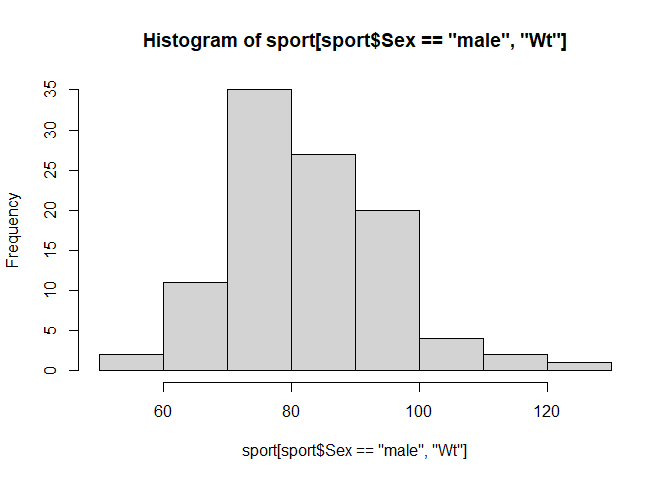<!-- -->

7.  Use a Bayesian approach to compare the weight of Australian athletes
    to 85.9 kg. Compare approaches that give the null more and less
    weight.

<!-- end list -->

``` r
library(BayesFactor)
```

    ## Loading required package: coda

    ## 
    ## Attaching package: 'coda'

    ## The following object is masked from 'package:VGAM':
    ## 
    ##     nvar

    ## Loading required package: Matrix

    ## ************
    ## Welcome to BayesFactor 0.9.12-4.2. If you have questions, please contact Richard Morey (richarddmorey@gmail.com).
    ## 
    ## Type BFManual() to open the manual.
    ## ************

``` r
ttestBF(sport[sport$Sex == "male", "Wt"], mu=85.9)
```

    ## Bayes factor analysis
    ## --------------
    ## [1] Alt., r=0.707 : 3.818236 ±0%
    ## 
    ## Against denominator:
    ##   Null, mu = 85.9 
    ## ---
    ## Bayes factor type: BFoneSample, JZS

``` r
ttestBF(sport[sport$Sex == "male", "Wt"], mu=85.9, rscale = "ultrawide")
```

    ## Bayes factor analysis
    ## --------------
    ## [1] Alt., r=1.414 : 2.124392 ±0%
    ## 
    ## Against denominator:
    ##   Null, mu = 85.9 
    ## ---
    ## Bayes factor type: BFoneSample, JZS

*Both answers give a Bayes Factor \>1, which is evidence against the
null. However, support is fairly weak (2.12-3.8, largely anecdotal), and
you can see the “ultrawide” option gives even more weight to the null."*
