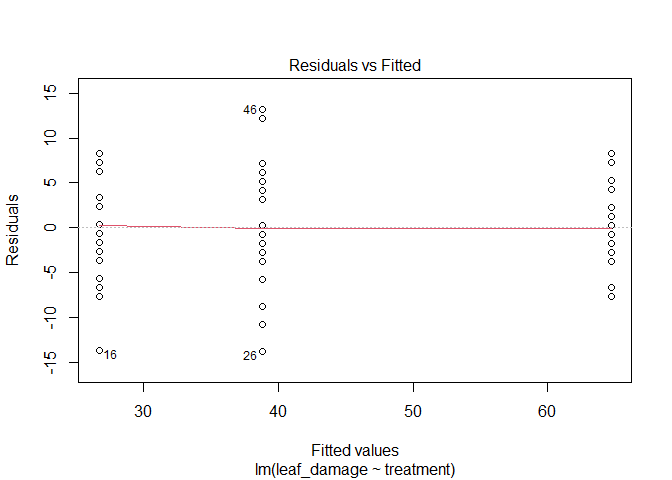
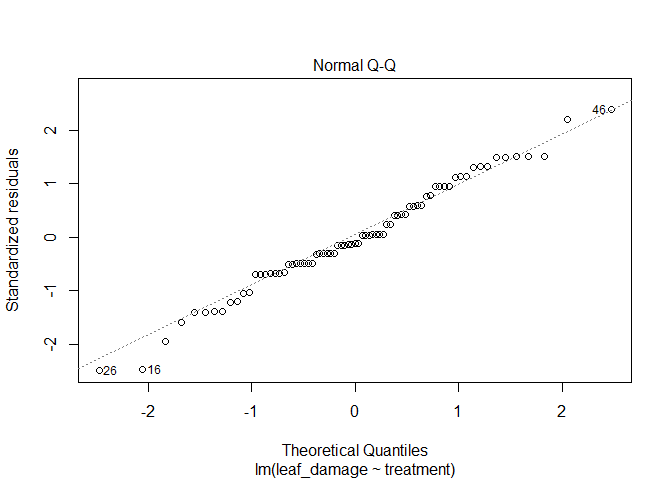
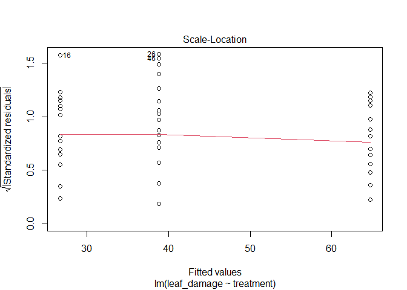
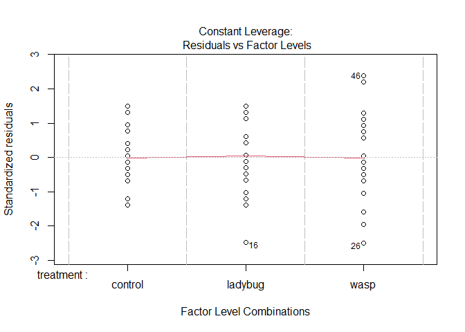
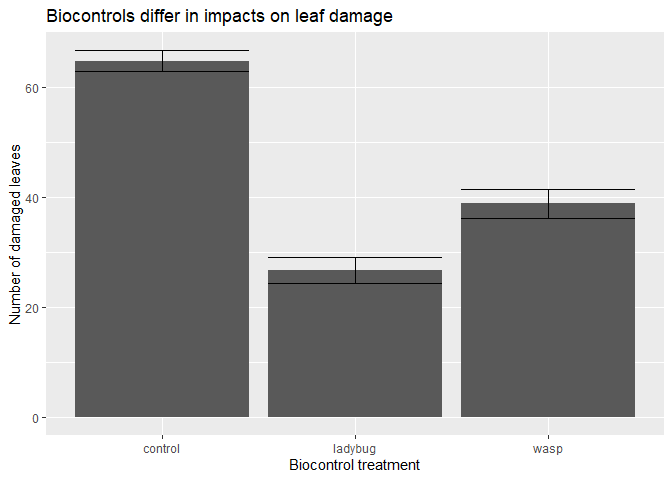

Quiz 6
================
jsg
11/20/2020

# Biocontrol effectiveness\!


Figure 1: The *parasitic wasp* Trioxys complanatus is a biological
control agent introduced to combat the spotted alfalfa aphid. . CSIRO,
CC BY 3.0 \<<https://creativecommons.org/licenses/by/3.0>


Fig 2: Two different sized Seven Spotted-Ladybug (*Coccinella
septempunctata*) eating mealybugs/aphids. Zeynel Cebeci, CC BY-SA 4.0
<https://creativecommons.org/licenses/by-sa/4.0>, via Wikimedia Commons

Building on earlier experiments (Quiz 5\!), a group of scientists is now
considering if the usefulness of 2 different predators in controlling
herbivory by an invasive aphid. Scientists measure the number of damaged
leaves along 10 m surveys in fields that have had no biocontrol
(control) and those where parasitic wasps (Figure 1) or predatory
ladybugs (Figure 2). Data is available using

``` r
damage <- read.csv("https://docs.google.com/spreadsheets/d/e/2PACX-1vRHZzd1CivJEUGnZetFnou_pEgyJD93G2-GHs2wNMMb2p-uXAN9sybg7sPfRcd7i_nUF65bGHwbQ8ph/pub?gid=976089384&single=true&output=csv", header = T, stringsAsFactors = T)
```

How would you evaluate the data?

Make sure your answers include

  - null hypothesis

*There is no difference in the average number of damaged leaves based on
treatment* -\> mean number damaged leaves<sub>control\_plot</sub> = mean
number of damaged leaves<sub>wasp\_plots</sub> = mean number of damaged
leaves<sub>ladybug\_plots</sub>

  - alternative hypothesis

*There is a difference in the average number of damaged leaves based on
treatment* -\> **So at least one of the following equalities does not
hold\!**

mean number damaged leaves<sub>control</sub> = mean number of damaged
leaves<sub>wasp</sub> = mean number of damaged leaves<sub>ladybug</sub>

  - explanation for test you will use

*I will use an ANOVA (form of linear model) since the outcome is a
continuous variable and we are considering differences among groups.*

  - results from statistical test (including post-hoc tests if needed\!)

<!-- end list -->

``` r
damage_lm <- lm(leaf_damage~treatment, damage)
plot(damage_lm)
```

<!-- --><!-- --><!-- -->

``` r
library(car)
```

    ## Loading required package: carData

``` r
Anova(damage_lm, type = "III")
```

    ## Anova Table (Type III tests)
    ## 
    ## Response: leaf_damage
    ##             Sum Sq Df F value    Pr(>F)    
    ## (Intercept) 104717  1 3285.98 < 2.2e-16 ***
    ## treatment    18882  2  296.25 < 2.2e-16 ***
    ## Residuals     2294 72                      
    ## ---
    ## Signif. codes:  0 '***' 0.001 '**' 0.01 '*' 0.05 '.' 0.1 ' ' 1

``` r
library(multcomp)
```

    ## Loading required package: mvtnorm

    ## Loading required package: survival

    ## Loading required package: TH.data

    ## Loading required package: MASS

    ## 
    ## Attaching package: 'TH.data'

    ## The following object is masked from 'package:MASS':
    ## 
    ##     geyser

<!-- -->

``` r
damage_compare <-   glht(damage_lm, linfct = mcp(treatment = "Tukey"))
summary(damage_compare)
```

    ## 
    ##   Simultaneous Tests for General Linear Hypotheses
    ## 
    ## Multiple Comparisons of Means: Tukey Contrasts
    ## 
    ## 
    ## Fit: lm(formula = leaf_damage ~ treatment, data = damage)
    ## 
    ## Linear Hypotheses:
    ##                        Estimate Std. Error t value Pr(>|t|)    
    ## ladybug - control == 0  -38.040      1.597 -23.824   <1e-09 ***
    ## wasp - control == 0     -25.920      1.597 -16.234   <1e-09 ***
    ## wasp - ladybug == 0      12.120      1.597   7.591   <1e-09 ***
    ## ---
    ## Signif. codes:  0 '***' 0.001 '**' 0.01 '*' 0.05 '.' 0.1 ' ' 1
    ## (Adjusted p values reported -- single-step method)

*I first found that the model was appropriate as evidenced by the
residual plots (there is no pattern in the residuals and they are
normally distributed). The ANOVA led to an F<sub>2,72</sub> value of
296.25 and a p-value of \<.01, so I reject the null hypothesis of no
difference among groups. Given there are more than 2 groups, I next
carried out post-hoc tests to determine which groups were different.
Post hoc tests using the Tukey approach showed that all treatments
differed from all others. The graph (below) and estimates showed that
control plots suffered the most damage, followed by wasp and ladybug
plots.*

  - clear explanation of how results relate to your stated hypotheses

*Noted above.*

  - a graph that clearly displays the data

<!-- end list -->

``` r
library(Rmisc)
```

    ## Loading required package: lattice

    ## Loading required package: plyr

``` r
damage_summary <- summarySE(damage, measurevar = "leaf_damage", groupvars = "treatment")
library(ggplot2)
ggplot(damage_summary, aes(x=treatment, y=leaf_damage))+
  geom_col() +
  geom_errorbar(aes(ymin = leaf_damage-ci, ymax = leaf_damage+ci))+
  xlab("Biocontrol treatment")+
  ylab("Number of damaged leaves")+
  ggtitle("Biocontrols differ in impacts on leaf damage")
```

<!-- -->
